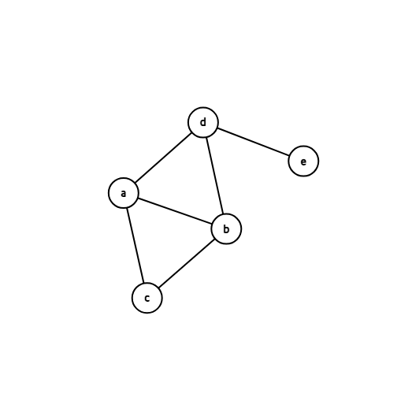

# Graph as Topological Space

## 1. Introduction: graph

  

  Graphs are widely used across various fields, including computer science, operations research, and mathematics. In particular, they offer a powerful way to represent relationships between objects. A graph consists of vertices and edges—typically, vertices stand for objects, while edges represent the relationships connecting them. One of the most familiar applications of graphs is modeling paths: for instance, we can think of each vertex as a city and each edge as a road. If we assign weights to the edges, we can then apply specific algorithms to find the shortest path.

  Now, solving problems using graphs is undoubtedly interesting. But beyond that, there’s also value in studying graphs for their own sake. There are several ways to approach this, and in this essay, I’ll take a topological perspective. More specifically, I’ll explore how we can view graphs as topological spaces using two different approaches. First, I’ll consider a graph as a discrete set. Then, I’ll look at it as a continuous one. Finally, I’ll discuss how concepts like graph isomorphism and topological homeomorphism can be understood in this context

  Firstly, it’s important to understand what kind of structure a graph actually is. A graph $G$ is a mathematical structure composed of a vertex set $V$ and an edge set $E$. We typically express this as $G = (V, E)$. Vertices and edges are the fundamental units of a graph: a vertex represents a point in the graph, while an edge represents a connection between two vertices. More concretely, we can describe the elements of $V$ and $E$ as follows.

$$
u,v \in V, (u,v)\in E \tag{1.1}
$$

  If edges have weight,

$$
(u,v,w) \in E, w \in W \tag{1.2}
$$

  The $W$ can be real numbers $\mathbb{R}$, or integers $\mathbb{Z}$, etc. Also, the edge $(u,v,w)$ and $(v,u,w)$ are considered equivalent. If a graph has duplicated edges, each edge can be represented in multiple ways.

  Below is example of graph.

Fig 1. Example of graph.

  The graph in fig 1 has 5 vertices and 6 edges. The vertex set and edge set is

$$
V = \{a,b,c,d,e\} \\ E=\{(a,b),(a,c),(a,d),(b,c),(b,d),(d,e)\}
$$

  

  Some graphs are defined to have an infinite number of vertices or edges—these are called *infinite graphs*. However, in this essay, I will focus only on *finite graphs*, where both the vertex set and the edge set are finite.

## 2. Topology

  To take a topological perspective, we first need to understand the concepts of topology and topological spaces. A *topology* can be defined on a set $X$, but not every collection of subsets qualifies as a topology. In order for a collection to be considered a topology, it must satisfy the following three axioms:

$$
\begin{array}{rl}
\text{2.1} & \empty \ \text{and} \ X \ \text{are\ in}\  \tau \\
\text{2.2} & \text{The\ union\ of\ the\ elements\ of\ any\ finite\ subcollection\ of\ } \tau\ \text{is\ in\ } \tau \\
\text{2.3} & \text{The\ intersection\ of\ the\ elements\ of\ any\ finite\ subcollection\ of\ } \tau\ \text{is\ in\ } \tau
\end{array}
$$

A set $X$ equipped with a topology $\tau$ is called a *topological space*. In addition, we say that a subset $U$ of $X$ is an *open set* of $X$ if $U$ belongs to $\tau$. [1]

  Now, let $X$ be a discrete finite set. We define the topology $\tau$ as follows:

$$
\tau = \{V|V\subset X\} \tag{2.4}
$$

Let’s check whether this definition satisfies the three conditions. First, since $\emptyset \subset X$ and $X \subset X$, condition 2.1 is satisfied. Next, if $A, B \subset X$, then both $A \cup B$ and $A \cap B$ are also subsets of $X$. Therefore, any union or intersection of finite subcollections of $\tau$ is also in $\tau$, which means conditions 2.2 and 2.3 are satisfied.

  Therefore, we conclude that any discrete finite set admits a topology, namely the discrete topology, where every subset is open. This shows that a topology can always be defined on any discrete finite set, making it a topological space.

## 3. Graph as Topological Space: Discrete Interpretation

  To view a graph as a topological space, we must first regard the graph as a set. For this purpose, I propose two approaches. In this chapter, I consider the graph as the product set of its vertex set and edge set.

  As discussed in the previous chapter, any discrete finite set admits a topology. Therefore, both the vertex set and the edge set of a graph can be given discrete topologies. Using the product topology on the Cartesian product of these sets, we can define a topology on the graph itself.

  In this sense, any finite graph can be treated as a topological space, when considered as the product of its vertex and edge sets endowed with discrete topologies.

  However, this approach has a limitation. Since the sets involved are discrete, defining continuity of a function or other topological properties becomes difficult. As a result, although we can formally define a topology on a graph this way, it is not always easy to extract meaningful mathematical or geometric interpretations from it.

## 4. Graph as Geometric Topological Space

  The purpose of this chapter is to define graphs as topological spaces in a way that enables geometric interpretation and analysis. To do this, we assign a weight to each edge, and then associate each edge $e_i \in E$ with a closed interval $[0, w_i]$, where $w_i$ is the weight of the edge $e_i$. (The idea is adapted from the discussion in [2].)

  In this framework, the graph becomes a continuous space. The vertices and edges are no longer treated as discrete elements; instead, we think of the graph as a collection of intervals, and a point p may lie anywhere along an edge or at a vertex. Essentially, the graph is now formed by gluing together intervals $[0, w_i]$, one for each edge, at shared endpoints corresponding to the vertices.

  More precisely, if two edges $e_i$ and $e_j$ are both incident to a vertex $v_k$, then the corresponding intervals $[0, w_i]$ and $[0, w_j]$ are joined at that point. This approach may be easier to understand if you think of a simple example: a path graph. Under this model, a path graph becomes a space that closely resembles a subspace of $\mathbb{R}$.

  To define a topology on a graph $G$, we must first specify the underlying set $X$. Let us define $X$ as follows:

$$
X=\bigcup_{e_i \in E}I_i \tag{4.1}
$$

  Here, $I_i$ denotes the interval $[0, w_i]$ associated with the edge $e_i$, and all points on each interval are considered distinct, except at the endpoints corresponding to vertices. A point on $I_i$ is denoted by $(t,u)_i$, where $t \in [0, w_i]$, and $e_i=(u,v,w_i)$.

  Moreover, points on different intervals that represent the same vertex are identified. For example, if $eᵢ = (a, b, wᵢ)$ and $eⱼ = (b, c, wⱼ)$, then the points $(wᵢ,a)_i$ and $(0,b)_j$ are considered equivalent, since they both correspond to the vertex $b$.

  Next, let us define a collection $S$, which must satisfy the following three conditions:

1. The set $S$ includes $∅$ and $X$
2. $S$ includes every subset $U ⊆ X$ such that for every $eᵢ ∈ E$, the intersection $U ∩ I_i^{\prime}$ is an open set in $Iᵢ$, where $Iᵢ^\prime$ denotes the open interval $(0, wᵢ)$ associated with the edge $eᵢ$.
    
    — Both $I_i$ and $I_i^\prime$ are equipped with the subspace topology inherited from the standard topology of $\mathbb{R}$. —
    
3. If the point $p$ corresponding to a vertex $v$ is contained in $U$, then there exists a $\delta > 0$ such that for every edge $e$ incident to $v$, the interval $[p, p + \delta)$ (on the edge $e$) is contained in $U$; that is, $[p, p + \delta) \cap U = [p, p + \delta)$ for all such edges.

  Then, check $S$ satisfies the axioms. Let, $U_1$, $U_2$ $\in S$.

**First axiom, $2.1$:**

  From the definition, $S$ includes $\empty$ and $X$, thus it satisfies axiom $2.1$.

By mathematical induction, it suffices to verify axioms $2.2$ and $2.3$ for the union and intersection of two sets. Specifically, if $U_1 \cap U_2 \in S$, $\forall U_1, U_2 \in S$, then it follows that $(U_1 \cap U_2) \cap U_3 \in S$, $\forall U_3 \in S$. A similar argument applies to the case of unions. Also, condition 1 concerns only the inclusion of $X$ and $\empty$ in the collection, so we do not need to check it when verifying axioms $2.2$ and $2.3$.

**Second axiom, $2.2$:**

  Let, $U_\cup = U_1 \cup U_2$. Then $U_\cup \cap I_i^\prime = (U_1 \cap I_i^\prime )\cup(U_2 \cap I_i^\prime)$. Since both $U_1 \cap I_i^\prime$ and $U_2 \cap I_i^\prime$ are open subsets of $I_i^\prime$, their union is also open in $I_i^\prime$. Therefore, $U_\cup$ satisfies condition 2.

Now consider any point $p$ corresponding to a vertex $v$ that is contained in $U_\cup$. There are two cases:

- If $p \in U_1 \cap U_2$, then there exist $\delta_1 > 0$ for $U_1$ and $\delta_2 > 0$ for $U_2$ such that intervals $(p, p+\delta_1)$ and $(p, p+\delta_2)$ are contained in $U_1$ and $U_2$, respectively. Let $\delta = \min\{\delta_1, \delta_2\}$. Then $(p, p+\delta)$ is contained in $U_\cup$.
- Otherwise, without loss of generality, assume $p \in U_1$. Since $U_1$ satisfies condition 3, there exists $\delta_1 > 0$ such that $(p, p+\delta_1) \subset U_1 \subset U_\cup$. So we can take $\delta = \delta_1$.

In either case, $U_\cup$ satisfies condition 3. Hence, $S$ satisfies all required conditions.

**Third axiom, $2.3$:**

  The verification of axiom $2.3$ proceeds in a similar manner to that of $2.2$. Let, $U_\cap = U_1 \cap U_2$. Then $U_\cap \cap I_i^\prime = (U_1 \cap I_i^\prime )\cap(U_2 \cap I_i^\prime)$. Since both $U_1 \cap I_i^\prime$ and $U_2 \cap I_i^\prime$ are open subsets of $I_i^\prime$, their intersection is also open in $I_i^\prime$. Therefore, $U_\cap$ satisfies condition 2.

Now consider any point $p$ corresponding to a vertex $v$ that is contained in $U_\cap$. There are two cases:

- If $p \in U_1 \cap U_2$, then there exist $\delta_1 > 0$ for $U_1$ and $\delta_2 > 0$ for $U_2$ such that intervals $(p, p+\delta_1)$ and $(p, p+\delta_2)$ are subset of $U_1$ and $U_2$, respectively. Let $\delta = \min\{\delta_1, \delta_2\}$. Then $(p, p+\delta)$ is contained in $U_\cap$.
- Otherwise, without loss of generality, assume $p \in U_1$ but $p \notin U_2$. Since $U_1$ satisfies condition 3, there exists $\delta_1 > 0$ such that $(p, p + \delta_1) \subset U_1$. However, because $p \notin U_2$, we have $p \notin U_\cap = U_1 \cap U_2$, and therefore we do not need to check condition 3 in this case.

In either case, $U_\cap$ satisfies condition 3.

Now that we have verified that $S$ satisfies all the axioms of a topology, we can define a topology $\tau = S$ on the set $X$.

  By using this approach, we can treat graphs as geometric objects, allowing us to embed them in Euclidean spaces in some cases. This enables various applications of graphs and opens the door to many interesting problems and interpretations.

## References

[1] Munkres, J.R. *Topology*. 2nd ed. Prentice Hall, Upper Saddle River (2000)

[2] Wikipedia contributors. *Topological graph theory – Graphs as topological spaces*. Wikipedia, The Free Encyclopedia. https://en.wikipedia.org/wiki/Topological_graph_theory. Accessed 4 June 2025.
